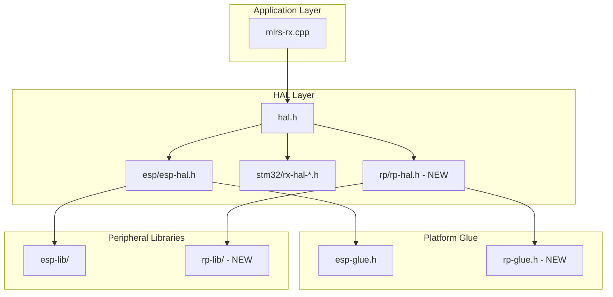

# RP2040 Receiver Support Implementation Plan

Add RP2040 (Raspberry Pi Pico) as a supported platform for mLRS receivers. The implementation will also be compatible with RP2350 with no code changes.

## User Review Required

> [!IMPORTANT]
> **Hardware Requirements**: This implementation assumes you have access to an RP2040 board with an SX126x, SX127x, SX128x, or LR11xx RF module wired up. Without hardware, we can only verify that the code compiles.

> [!TIP]
> **Why RP2040 first**: Better ecosystem maturity, more small form-factor boards available, and the arduino-pico core is more battle-tested. RP2350 compatibility is automatic.

> [!WARNING]
> **Cortex-M0 Limitations**: RP2040's M0+ lacks DWT (cycle counter) and has only 4 interrupt priority levels vs STM32's 16. Mitigations: dual-core design isolates timer ISR on Core 1; `time_us_64()` provides 1µs timing; 3 priority levels sufficient for RX.
> 
> **Timing Precision**: To achieve low jitter, the ISR must be marked with `__not_in_flash_func()` to avoid stalls during flash access. While the SDK alarm pool is the simplest start, a PIO state machine can be used for absolute cycle-accurate 10µs pulses if jitter from standard interrupts becomes an issue.

**Key design decisions finalized:**
1. **Target board**: Raspberry Pi Pico (dev target).
2. **RF module**: SX126x (E22 or similar) with discrete TX_EN and RX_EN pins.
3. **Hardware Strategy**: Simple SPI and UART (no DMA to start for complexity reduction).

---

## Architecture Overview

The mLRS HAL is well-structured with clear separation:



---

## Proposed Changes

### Component 1: Platform Glue

Create the RP2040 platform glue that bridges Arduino APIs to mLRS abstractions.

#### [NEW] [rp-glue.h](file:///Users/jlp/Documents/mLRS/mLRS/Common/hal/rp-glue.h)

Adapts from [esp-glue.h](file:///Users/jlp/Documents/mLRS/mLRS/Common/hal/esp-glue.h):
- Define `IRQHANDLER` macro for interrupt handlers
- Provide `__disable_irq()` / `__enable_irq()` via `noInterrupts()` / `interrupts()`
- Define `HAL_StatusTypeDef` enum
- Byte-swap macros (`__REV16`, `__REV`, etc.)
- Controller restart mechanism (`INITCONTROLLER_ONCE`, `RESTARTCONTROLLER`, etc.)

---

### Component 2: Peripheral Library

Create RP2040 peripheral abstractions that mirror the ESP library structure.

#### [NEW] [rp-peripherals.h](file:///Users/jlp/Documents/mLRS/mLRS/Common/rp-lib/rp-peripherals.h)

GPIO abstraction based on [esp-peripherals.h](file:///Users/jlp/Documents/mLRS/mLRS/Common/esp-lib/esp-peripherals.h):
- Pin definitions (`IO_P0` through `IO_P29` for RP2350)
- `IOMODEENUM` enum matching ESP version
- Functions: `gpio_init()`, `gpio_low()`, `gpio_high()`, `gpio_toggle()`, `gpio_read_activehigh()`, `gpio_read_activelow()`

#### [NEW] [rp-spi.h](file:///Users/jlp/Documents/mLRS/mLRS/Common/rp-lib/rp-spi.h)

SPI driver based on [esp-spi.h](file:///Users/jlp/Documents/mLRS/mLRS/Common/esp-lib/esp-spi.h):
- `spi_select()` / `spi_deselect()` for chip select
- `spi_transfer()`, `spi_read()`, `spi_write()` using Arduino SPI
- `spi_init()` with configurable frequency

#### [NEW] [rp-uart-template.h](file:///Users/jlp/Documents/mLRS/mLRS/Common/rp-lib/rp-uart-template.h)
#### [NEW] [rp-uart-generate.py](file:///Users/jlp/Documents/mLRS/mLRS/Common/rp-lib/rp-uart-generate.py)

UART template and generator script (following ESP pattern):
- Template with `UART$`/`uart$` placeholders
- Generator creates `rp-uart.h`, `rp-uartb.h`, `rp-uartc.h`, etc.
- **Hardware UART inversion** for SBUS (zero overhead):
  ```cpp
  Serial1.setInvertTX(true);  // hardware inversion for SBUS
  Serial1.setInvertRX(true);  // if needed for inverted input
  Serial1.begin(100000, SERIAL_8E2);  // SBUS: 100kbaud, 8E2
  ```

> [!NOTE]
> **TX Half-Duplex**: RP2040 has no native half-duplex on hardware UARTs. This is not required for receiver functionality. If ever needed for a TX module (e.g., S.Port), PIO UART via `SerialPIO` provides an excellent single-wire solution with hardware inversion.

#### [NEW] [rp-eeprom.h](file:///Users/jlp/Documents/mLRS/mLRS/Common/rp-lib/rp-eeprom.h)

Flash-based EEPROM emulation based on [esp-eeprom.h](file:///Users/jlp/Documents/mLRS/mLRS/Common/esp-lib/esp-eeprom.h):
- **LittleFS (Selected Strategy)**: We will use LittleFS via the `arduino-pico` core. It provides wear leveling and power-fail safety (atomic file updates).
- **Implementation**:
  - `ee_init()`: Mounts LittleFS, checks for config file existence.
  - `ee_readdata()`: Reads from `/config.bin`.
  - `ee_writedata()`: Writes to `/config.bin` (LittleFS handles atomic rename/replacement internally).
- **Pros**: Zero manual flash management, high reliability, extensible to multiple files.
- **Cons**: Small flash overhead (~64KB-1MB FS partition), but negligible on 2MB+ Pico flash.

#### [NEW] [rp-delay.h](file:///Users/jlp/Documents/mLRS/mLRS/Common/rp-lib/rp-delay.h)

Delay utilities:
- `delay_us()`, `delay_ms()` wrappers

#### [NEW] [rp-mcu.h](file:///Users/jlp/Documents/mLRS/mLRS/Common/rp-lib/rp-mcu.h)

MCU utilities:
- `mcu_serial_number()` for unique ID (RP2040 has unique flash ID)

#### [NEW] [rp-stack.h](file:///Users/jlp/Documents/mLRS/mLRS/Common/rp-lib/rp-stack.h)

Stack utilities:
- `stack_check_init()`, `stack_check()` for stack overflow detection

---

### Component 2.5: Additional HAL Files

#### [NEW] [rp-powerup.h](file:///Users/jlp/Documents/mLRS/mLRS/Common/hal/rp-powerup.h)

Powerup counter for bind detection (button held at startup).

---

### Component 3: RX Clock Synchronization (Critical)

This is the most timing-critical component - the receiver must precisely synchronize with transmitter timing.

#### [NEW] [rp-rxclock.h](file:///Users/jlp/Documents/mLRS/mLRS/Common/hal/rp-rxclock.h)

Based on [esp-rxclock.h](file:///Users/jlp/Documents/mLRS/mLRS/Common/hal/esp-rxclock.h):
- 10µs resolution timer interrupt
- `tRxClock` class with `Init()`, `SetPeriod()`, `Reset()`
- `doPostReceive` flag mechanism for main loop synchronization
- `HAL_IncTick()` for 1ms system tick

**Dual-Core Timer ISR (Key Performance Optimization):**

Run the 10µs timer ISR on Core 1 (like ESP32) to avoid interrupting main loop on Core 0:

```cpp
// setup1() and loop1() run on Core 1 automatically
void setup1() {
    // 10µs repeating timer on Core 1
    add_repeating_timer_us(-10, clock_10us_callback, NULL, &timer);
}

void loop1() {
    // empty - timer runs via interrupt
}
```

**Shared variable protection** using pico SDK spinlocks:
```cpp
spin_lock_t* clock_spinlock;

// in ISR on Core 1
spin_lock_unsafe_blocking(clock_spinlock);
CNT_10us++;
if (CNT_10us == CCR1) { /* update timing */ }
spin_unlock_unsafe(clock_spinlock);
```

> [!TIP]
> RP2040 advantages over ESP32: ~1µs ISR latency (vs ~2µs), symmetric cores, no RTOS overhead on Core 1.

---

### Component 4: Timer Utilities

#### [NEW] [rp-timer.h](file:///Users/jlp/Documents/mLRS/mLRS/Common/hal/rp-timer.h)

System tick and timing:
- `HAL_GetTick()` - millisecond tick counter
- `HAL_IncTick()` - called from RX clock ISR

---

### Component 5: HAL Splicer and Device Files

#### [NEW] [rp-hal.h](file:///Users/jlp/Documents/mLRS/mLRS/Common/hal/rp/rp-hal.h)

HAL splicer that includes correct device HAL based on build defines (mirrors [esp-hal.h](file:///Users/jlp/Documents/mLRS/mLRS/Common/hal/esp/esp-hal.h)).

#### [NEW] [rx-hal-generic-900-rp2040.h](file:///Users/jlp/Documents/mLRS/mLRS/Common/hal/rp/rx-hal-generic-900-rp2040.h)

First device configuration file:
- **RF module**: SX126x with TX_EN and RX_EN pins (e.g., Ebyte E22-900M22S)
- **Pin assignments** (Standard Pico SPI0/UART0):
  - SPI0: GP16 (MISO), GP17 (CS), GP18 (SCK), GP19 (MOSI)
  - UART: GP0 (TX), GP1 (RX)
  - RF Control: GP2 (Busy), GP3 (Reset), GP4 (DIO1), GP5 (TX_EN), GP6 (RX_EN)
  - LED: Onboard LED (GP25)
  - Button: GP22
- RF module control: `sx_init_gpio()`, `sx_amp_transmit()`, `sx_amp_receive()`
- Power/RF settings for SX126x

---

### Component 6: Build System Integration

#### [MODIFY] [hal.h](file:///Users/jlp/Documents/mLRS/mLRS/Common/hal/hal.h)

Add RP2350 include path:
```cpp
#if defined ARDUINO_ARCH_RP2040  // arduino-pico uses this for RP2040/RP2350
#include "rp/rp-hal.h"
#endif
```

#### [MODIFY] [platformio.ini](file:///Users/jlp/Documents/mLRS/platformio.ini)

Add RP2040 environment configuration:
```ini
[env_common_rp2040]
platform = https://github.com/maxgerhardt/platform-raspberrypi.git
framework = arduino
board = rpipico
board_build.core = earlephilhower
build_type = release
build_flags =
  -D ARDUINO_ARCH_RP2040
  -O2

[env_common_rx_rp2040]
extends = env_common_rp2040
build_src_filter = ${env_common_rx.build_src_filter}

[env:rx-generic-900-rp2040]
extends = env_common_rx_rp2040
build_src_filter =
  ${env_common_rx_rp2040.build_src_filter}
  +<modules/sx12xx-lib/src/sx127x.cpp>
build_flags =
  ${env_common_rp2040.build_flags}
  -D RX_GENERIC_900_RP2040
```

**Overclocking** (optional, for improved performance):
```ini
board_build.f_cpu = 250000000L  ; 250 MHz (default 133 MHz, safe OC)
```

> [!NOTE]
> For RP2350, change `board = rpipico` to `board = rpipico2` - no other changes needed.

---

### Component 7: Application Layer Modification

#### [MODIFY] [mlrs-rx.cpp](file:///Users/jlp/Documents/mLRS/mLRS/CommonRx/mlrs-rx.cpp)

Add RP2040 platform branch to the include conditionals (lines 30-90):

```cpp
#if defined ESP8266 || defined ESP32
    // existing ESP includes...
#elif defined ARDUINO_ARCH_RP2040
    #include "../Common/hal/rp-glue.h"
    #include "../modules/stm32ll-lib/src/stdstm32.h"
    #include "../Common/rp-lib/rp-peripherals.h"
    #include "../Common/rp-lib/rp-mcu.h"
    #include "../Common/rp-lib/rp-stack.h"
    #include "../Common/hal/hal.h"
    #include "../Common/rp-lib/rp-delay.h"
    #include "../Common/rp-lib/rp-eeprom.h"
    #include "../Common/rp-lib/rp-spi.h"
    #ifdef USE_SERIAL
    #include "../Common/rp-lib/rp-uartb.h"
    #endif
    #ifdef USE_DEBUG
    #include "../Common/rp-lib/rp-uartf.h"
    #endif
    #include "../Common/hal/rp-timer.h"
    #include "../Common/hal/rp-powerup.h"
    #include "../Common/hal/rp-rxclock.h"
#else
    // existing STM32 includes...
#endif
```

---

## File Summary

| File | Type | Description |
|------|------|-------------|
| `mLRS/Common/hal/rp-glue.h` | NEW | Platform glue |
| `mLRS/Common/rp-lib/rp-peripherals.h` | NEW | GPIO abstraction |
| `mLRS/Common/rp-lib/rp-spi.h` | NEW | SPI driver |
| `mLRS/Common/rp-lib/rp-uart-template.h` | NEW | UART template |
| `mLRS/Common/rp-lib/rp-uart-generate.py` | NEW | UART generator |
| `mLRS/Common/rp-lib/rp-uart.h` | GENERATED | UART driver |
| `mLRS/Common/rp-lib/rp-uartb.h` | GENERATED | UART (serial) |
| `mLRS/Common/rp-lib/rp-uartf.h` | GENERATED | UART (debug) |
| `mLRS/Common/rp-lib/rp-eeprom.h` | NEW | Flash EEPROM |
| `mLRS/Common/rp-lib/rp-delay.h` | NEW | Delay utilities |
| `mLRS/Common/rp-lib/rp-mcu.h` | NEW | MCU utilities |
| `mLRS/Common/rp-lib/rp-stack.h` | NEW | Stack checking |
| `mLRS/Common/hal/rp-rxclock.h` | NEW | RX clock (dual-core) |
| `mLRS/Common/hal/rp-timer.h` | NEW | Timer utilities |
| `mLRS/Common/hal/rp-powerup.h` | NEW | Powerup counter |
| `mLRS/Common/hal/rp/rp-hal.h` | NEW | HAL splicer |
| `mLRS/Common/hal/rp/rx-hal-generic-900-rp2040.h` | NEW | Device HAL (SX126x) |
| `mLRS/Common/hal/hal.h` | MODIFY | Add RP2040 include |
| `mLRS/CommonRx/mlrs-rx.cpp` | MODIFY | Add RP2040 branch |
| `platformio.ini` | MODIFY | Add RP2040 env |

---

## Verification Plan

### Build Verification

Run compilation to verify all new files integrate correctly:

```bash
cd /Users/jlp/Documents/mLRS
pio run -e rx-generic-900-rp2350
```

**Expected result**: Successful compilation with no errors.

### Manual Hardware Testing (User-Dependent)

> [!NOTE]
> Hardware testing requires an RP2350 board with RF module. Please provide hardware availability and wiring details.

1. **Flash firmware** to RP2350 board
2. **Power on** and verify LED behavior (should blink indicating no connection)
3. **Pair with TX** module and verify bind process works
4. **Test RC output** - verify SBUS/CRSF output on serial port
5. **Range test** - verify RF link quality comparable to ESP/STM32 builds

---

## Estimated Effort

| Phase | Estimate |
|-------|----------|
| Platform glue + peripherals | 2-4 hours |
| RX clock synchronization | 4-6 hours |
| Device HAL + build config | 2-3 hours |
| Build testing + debugging | 4-8 hours |
| **Total** | **12-21 hours** |

---

## Open Questions

1. Do you have specific RP2040 hardware in mind, or should I design for a generic dev board first?
2. Which RF module should be prioritized (SX126x/SX127x for 900MHz, SX128x for 2.4GHz)?
3. Any specific features to prioritize or exclude for the initial implementation?
